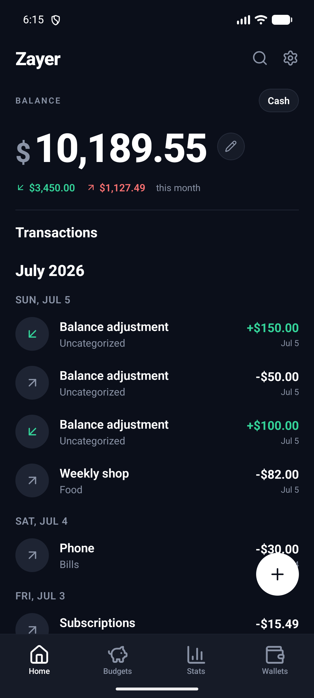
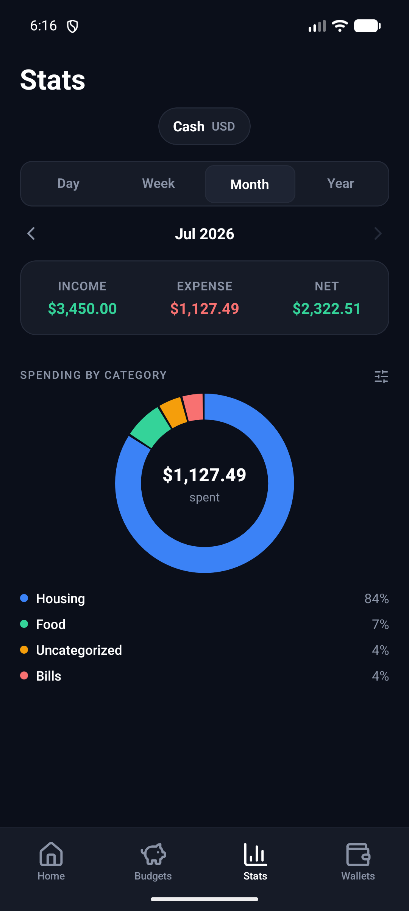
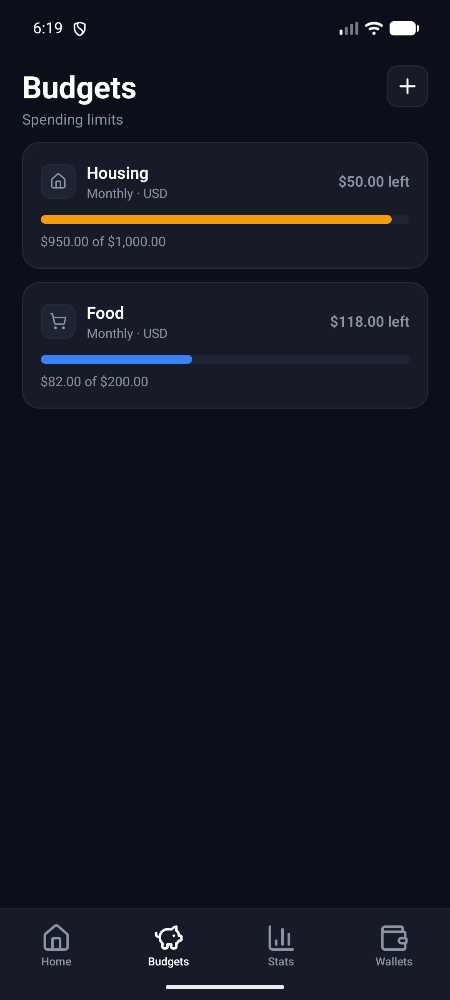
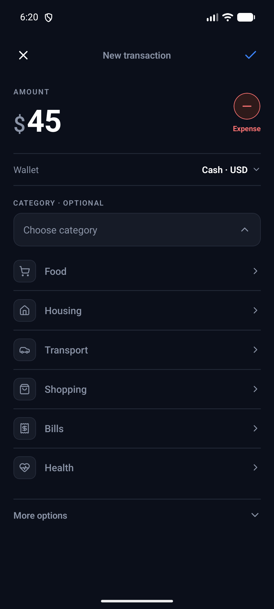
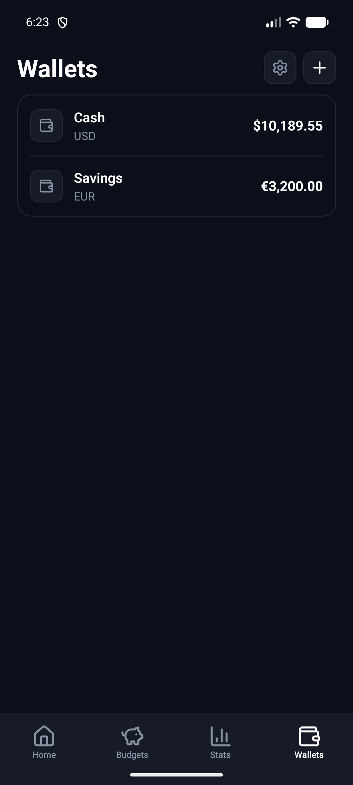
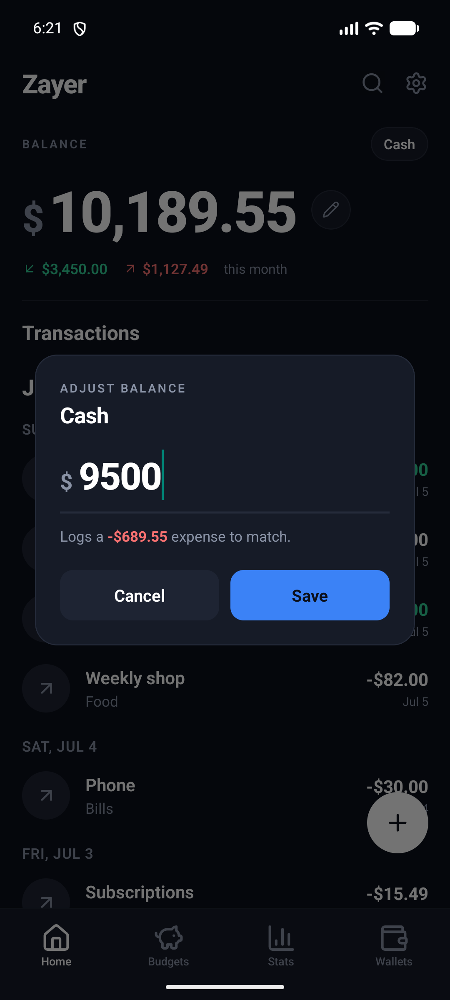

<div align="center">


# Zayer

**A fast, private, offline-first budgeting app for tracking money across wallets and currencies.**

Every dollar is accounted for — balances are *derived* from the ledger, never edited behind your back. No accounts, no sync, no cloud. Your data lives on your device.

<br />


</div>

---

## Overview

Zayer is a personal finance tracker built with Expo and React Native. It keeps a clean, honest ledger of your transactions and derives everything else — balances, monthly summaries, spending breakdowns, budget progress — from that single source of truth. It runs entirely on-device against a local SQLite database, so it works with no network and shares nothing.

The whole app is styled in one deliberate dark theme: the balance floats as a large figure over a near-black ground, with a blue accent, green for money in, red for money out, and amber to warn when a budget is running hot.

---

## Screenshots

<table>
  <tr>
    <td width="33%"></td>
    <td width="33%"></td>
    <td width="33%"></td>
  </tr>
  <tr>
    <td align="center"><b>Home</b><br/>Balance, month glance & feed</td>
    <td align="center"><b>Stats</b><br/>Spending by category</td>
    <td align="center"><b>Budgets</b><br/>Limits with live progress</td>
  </tr>
  <tr>
    <td width="33%"></td>
    <td width="33%"></td>
    <td width="33%"></td>
  </tr>
  <tr>
    <td align="center"><b>Add transaction</b><br/>Amount, wallet & category</td>
    <td align="center"><b>Wallets</b><br/>One currency each</td>
    <td align="center"><b>Adjust balance</b><br/>Logs the difference</td>
  </tr>
</table>

---

## Features

### 💰 Wallets & balances
- **Multiple wallets, each in its own currency** — Cash in USD, Savings in EUR, and so on. Currencies are never blended without a rate, so each wallet stands alone.
- **Derived balances** — a wallet's balance is computed as `starting balance + income − expenses` in a single SQL query. The number you see is always explainable by the transactions beneath it.
- **Inline balance correction** — tap the ✏️ next to the balance to set it to whatever you actually have. Instead of silently overwriting the number, Zayer logs the *difference* as a "Balance adjustment" transaction (lower → expense, higher → income), so the ledger stays honest.
- Add, rename, and delete wallets; the last wallet can't be deleted, and deleting one cleanly removes its transactions.

### 🧾 Transactions
- Record **expenses and income** with a single toggle.
- Tag with an optional **category and subcategory** (a category works on its own — subcategories just refine it).
- Optional **title, memo, and date** under *More options*.
- The feed is **grouped by day and bannered by month**, newest first, and pages in as you scroll.
- Smart display titles: a transaction shows its title, or falls back to its subcategory → category → "Expense/Income".

### 📊 Stats
- Scope stats to **one wallet** (currency-safe) via a centered picker.
- Switch between **Day / Week / Month / Year**, and **swipe left/right** to page through periods with a smooth animation (you can't page into the future).
- An **Income / Expense / Net** summary card for the window.
- **Spending by category** in three views — **bars**, an SVG **donut** with a color legend, and a **ranked list**.

### 🎯 Budgets
- Set a spending limit for **Overall**, a **category**, or a **subcategory**.
- Choose the reset period: **Daily / Monthly / Yearly**.
- Each budget shows a **live progress bar** that shifts from accent blue → **amber past 85%** → **red when over**, plus "left"/"over" amounts. Budgets match spending by currency and scope.

### 🔎 Search
- Fast, debounced **full-text search** over transaction titles, notes, and category/subcategory names.

### 🔄 Import & export (CSV)
- **Import** history from another app (e.g. *Wallet by BudgetBakers*) — Zayer detects the delimiter, auto-creates or matches wallets by name + currency, and resolves categories.
- **Export** every transaction to a CSV you can share, with wallet/category context, ISO dates, and signed amounts.

### 🗂️ Categories
- Manage a two-level tree (**categories → subcategories**), each typed as expense or income, with sensible defaults seeded on first run.

---

## Tech stack

| Area | Choice |
|------|--------|
| **Framework** | [Expo](https://expo.dev) SDK `~54.0` · React Native `0.81` · React `19.1` (New Architecture) |
| **Navigation** | [Expo Router](https://docs.expo.dev/router/introduction) `~6.0` (file-based, typed routes) |
| **Database** | [expo-sqlite](https://docs.expo.dev/versions/latest/sdk/sqlite/) + [Drizzle ORM](https://orm.drizzle.team) `^0.45` with drizzle-kit migrations |
| **UI** | Custom dark design system · [lucide-react-native](https://lucide.dev) icons · [react-native-svg](https://github.com/software-mansion/react-native-svg) charts · [reanimated](https://docs.swmansion.com/react-native-reanimated/) + gesture-handler |
| **Keyboard** | [react-native-keyboard-controller](https://kirillzyusko.github.io/react-native-keyboard-controller/) |
| **Testing** | Jest + jest-expo · [@testing-library/react-native](https://callstack.github.io/react-native-testing-library/) · better-sqlite3 · [Maestro](https://maestro.mobile.dev) E2E |

### Design tokens

The app is dark-only by design. The palette lives in [`constants/theme.ts`](constants/theme.ts):

| Token | Hex | Use |
|-------|-----|-----|
| `background` | `#0B0F1A` | App ground |
| `card` / `cardElevated` | `#161B27` / `#1E2433` | Surfaces |
| `text` / `textMuted` | `#FFFFFF` / `#8A93A6` | Type |
| `accent` | `#3B82F6` | Primary actions, progress |
| `positive` / `negative` | `#34D399` / `#F87171` | Money in / out |

---

## Data model

Money is stored everywhere as **integer minor units (cents)** — no floats — and **balances are always derived, never stored**. Drizzle schema in [`db/schema.ts`](db/schema.ts), applied via 4 migrations in [`drizzle/`](drizzle/) at launch.

```
wallets ──┐
          ├── transactions ──> categories (SET NULL)
          │                └──> subcategories (SET NULL)
          └── budgets ──────> categories / subcategories / wallet (CASCADE)

categories ──> subcategories (CASCADE)
```

- **wallets** — `name`, `currency`, `initial_balance` (cents), `archived`, `sort_order`.
- **categories / subcategories** — two fixed levels, each `kind` = expense or income.
- **transactions** — `amount` (positive cents) + `direction`, optional category/subcategory, `title`, `note`, `date`. Deleting a wallet cascades its transactions; deleting a category keeps the transaction but clears the link.
- **budgets** — `amount` limit + flexible scope (overall / category / subcategory), `period`, `currency`.

---

## Getting started

> **Prerequisites:** Node 18+, and a [development build](https://docs.expo.dev/develop/development-builds/introduction/) or emulator. Because Zayer uses native modules (SQLite, keyboard-controller, reanimated), it does **not** run in Expo Go.

```bash
# 1. Install dependencies
npm install

# 2. Start the dev server
npm start

# 3. Build & run on a device/emulator
npm run android   # or: npm run ios
```

On first launch the app seeds a default **Cash** wallet and a starter set of categories. In a dev build, **Settings → Insert sample data** drops in a few months of demo transactions (used for the screenshots above).

---

## Scripts

| Command | What it does |
|---------|--------------|
| `npm start` | Start the Expo dev server |
| `npm run android` / `npm run ios` | Build and run natively |
| `npm test` | Run the Jest suite (unit + integration + component) |
| `npm run e2e` | Run the Maestro device flows (emulator + Metro required) |
| `npm run apk` | Build a standalone release APK → `dist/` |
| `npm run lint` | Lint with `expo lint` |
| `npm run db:generate` | Generate a new Drizzle migration |
| `npm run db:studio` | Open Drizzle Studio |
| `npm run icons` | Regenerate app icons from the SVG sources |

---

## Testing

The suite is layered so it's fast to run and hard to fool — full plan in [`docs/TESTING.md`](docs/TESTING.md).

1. **Unit** — pure functions (formatting, CSV parse/serialize, grouping).
2. **Integration** — the real Drizzle queries against an **in-memory SQLite database built from the actual migration files**, so schema drift breaks the tests.
3. **Component** — screens and shared UI rendered with Testing Library over the real data layer.
4. **Device E2E** — [Maestro](https://maestro.mobile.dev) flows tapping through the installed build ([`e2e/flows/`](e2e/flows/)).

```bash
npm test        # unit + integration + component (~seconds)
npm run e2e     # Maestro flows on an emulator
```

Current status: **184 Jest tests** across unit, data-layer, and component suites, plus **8 Maestro flows**.

---

## Building a release APK

`npm run apk` produces a standalone, sideloadable release APK (JS bundled in, no Metro) at `dist/Zayer-<version>-release.apk` via [`scripts/build-apk.mjs`](scripts/build-apk.mjs).

It builds from a short path (`C:\zb`) to work around a Windows 260-character `MAX_PATH` limit hit by keyboard-controller's New-Architecture C++ codegen. Flags: `--fast` (JS-only, skip prebuild), `--no-deps`. The APK is signed with the debug keystore — fine for sideloading, not the Play Store. Details in [`docs/TESTING.md`](docs/TESTING.md#building-the-apk-npm-run-apk).

---

<div align="center">
<sub>Built with Expo · Drizzle · SQLite — offline, private, and honest about every cent.</sub>
</div>
